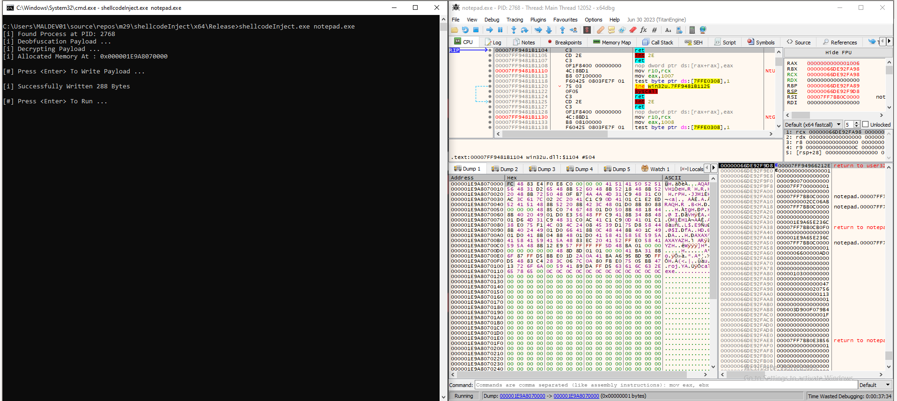
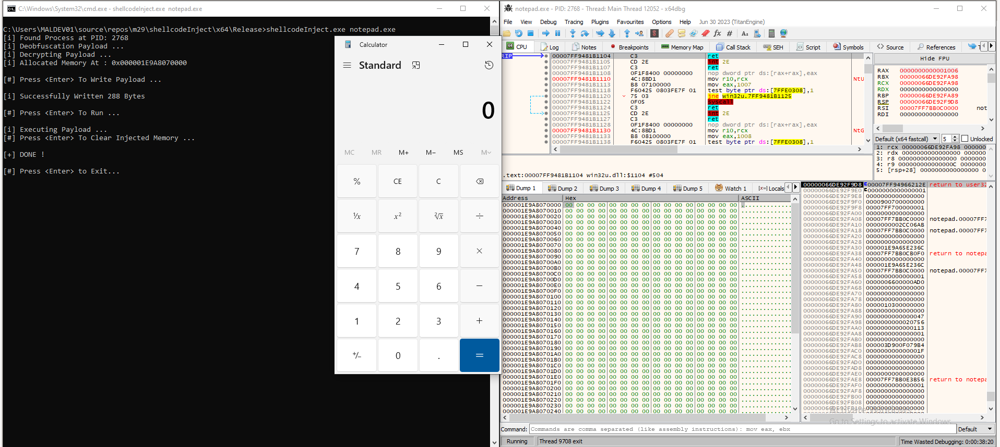

# Process Injection - Shellcode Injection

Used shellcode:

```
msfvenom -p windows/x64/exec CMD="calc.exe" -f hex
```

Obfuscated and encrypted with [payloadBuilder.exe](https://github.com/L4k4r/maldev/tree/main/tools/payloadBuilder)


The executable decrypt and deobfuscates shellcode, injects it into a process and executes it.



After it executes the shellcode, it clears the allocated memory in the injected process with `VirtualFreeEx`


